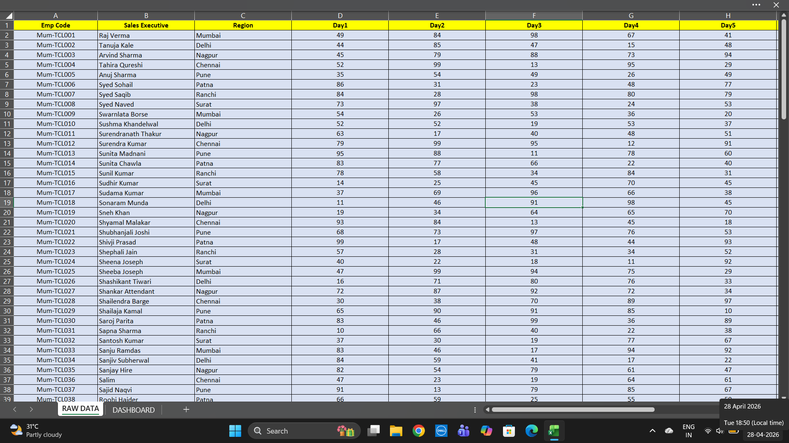
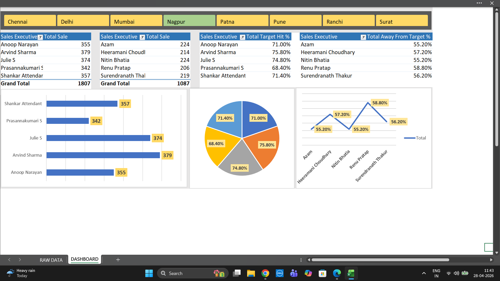
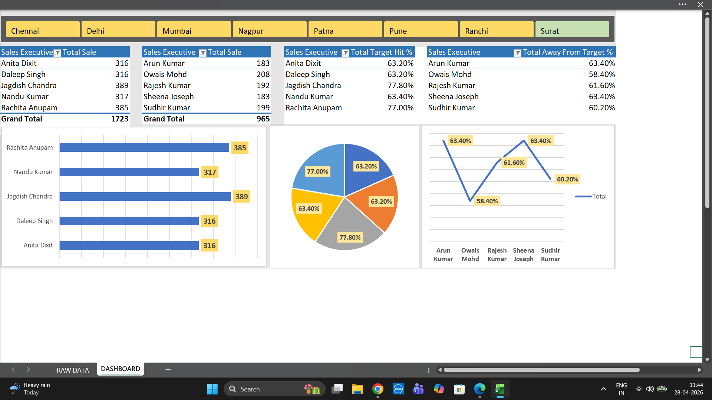

# Employee Sales Performance Dashboard

## Overview
This project focuses on analyzing employee sales performance across multiple cities using Microsoft Excel. The dashboard provides clear insights into sales trends, target achievement, and performance gaps.
## Objectives
- Analyze sales data of employees across different regions
- Visualize data for better decision-making
 
## Dataset
The dataset includes:
- Employee names and regions (Chennai, Delhi, Mumbai, etc.)
- Daily sales data (Day 1 – Day 5)
- Total sales
- Target values
- Target Hit %
- Performance gap (% away from target)

## Tools Used
- Microsoft Excel
- Data Cleaning & Structuring
- Data Visualization (Charts)

## Dashboard Features
- Total Sales by Employee
- Target Achievement %
- Gap Analysis (% away from target)
- City-wise Performance Comparison
- Visualizations:
  - Bar Chart
  - Pie Chart
  - Line Chart
## Screenshots
### Raw Data

### Dashboard View

### Dashboard View

## Key Insights
- Identified top-performing and low-performing employees
- Compared performance across different cities
- Highlighted gaps between actual sales and targets

## Conclusion
This project demonstrates how Excel can be used effectively for data analysis and dashboard creation, providing meaningful business insights.
